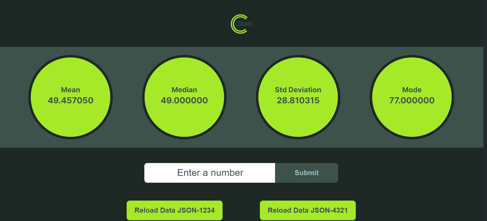

# Nenos Software Coding Challenge



## Objective

Develop a Single Page App (SPA) that shows a simple dashboard that displays four tiles, each displaying a single statistic for a dataset that is retrieved via a REST API call. The user should be able to request new data to be loaded and to see the statistics in the tiles update to reflect the new dataset.

## Requirements

1. The app shall be implemented using ReactJS components and developed using either JavaScript or TypeScript, with the latter preferred.
2. The app shall display four statistics tiles: Mean, Median, Standard Deviation, and Mode.
3. The app shall present a button which, when clicked, will cause a new dataset to be loaded(replacing the current dataset)and the dashboard display to be updated to reflect the newly loaded data.
4. The app shall present an input field that will accept a number and a submit button which, when clicked, will cause the number to be added to the currently loaded dataset and the dashboard tiles to update to reflect the new dataset state.

## Guidance

The appearance of the app and implementation approach are up to you. Don’t spend more than 8 hours. Timebox the effort and prioritize your time on what you think are the most important aspects. There is no right or wrong answer.

## Dashboard Tiles

1. Mean - [https://en.wikipedia.org/wiki/Arithmetic_mean](https://en.wikipedia.org/wiki/Arithmetic_mean 'Mean')
2. Median – [https://en.wikipedia.org/wiki/Median](https://en.wikipedia.org/wiki/Median 'Median')
3. Standard Deviation – [https://en.wikipedia.org/wiki/Standard_deviation](https://en.wikipedia.org/wiki/Standard_deviation 'Standard Deviation')
4. Mode – [https://en.wikipedia.org/wiki/Mode\_(statistics)](<https://en.wikipedia.org/wiki/Mode_(statistics)> 'Mode')

## Expected Results

### data-1234.json

| Tile       |  Default  | After adding 42 |
| :--------- | :-------: | --------------: |
| **Mean**   | 49.457050 |       49.451012 |
| **Median** | 49.000000 |       49.000000 |
| **StdDev** | 28.810315 |       28.799421 |
| **Mode**   | 77.000000 |       77.000000 |

### data-4321.json

| Tile       |  Default  | After adding 42 |
| :--------- | :-------: | --------------: |
| **Mean**   | 50.346679 |       50.344748 |
| **Median** | 51.000000 |       51.000000 |
| **StdDev** | 29.191159 |       29.188057 |
| **Mode**   | 82.000000 |       82.000000 |

## Tech Stack

### Client Stack

- ReactJS (Javascript)
- React Hooks
- Custom React Hooks
- Styled Components
- Framer Motion

### Server Stack (For Rest API Calls)

- Node
- Express
- Javascript


## Quick start

## Scripts

### `git clone`

```shell
   # clone this project. If you are forking it first, make sure to use your
   # own github username in place of mine ;)
   git clone https://github.com/dieterhalosta/NenosChallenge.git
```

### `npm install`

Once you clone the project, you will want to make sure you install all dependencies to get up and running.

```shell
  npm install
```

### `npm run start`

This command runs both the server and the client concurrently in development mode. The server is listening on [http://localhost:5000](http://localhost:5000) (Note: You will not be able to pull this up in a web browser directly) and the React app runs on [http://localhost:3000](http://localhost:3000)

If you want to run the code as-if you're in production, then update the local .env file with `NODE_ENV=production`

```shell
  npm run start
```

### `npm run server`

Open [http://localhost:5000/connection](http://localhost:5000/connection) in a web browser to test your Rest API. The connection endpoint (http://localhost:5000/connection) will show you some brief documentation and version information for the endpoints.


```shell
  npm run server
```